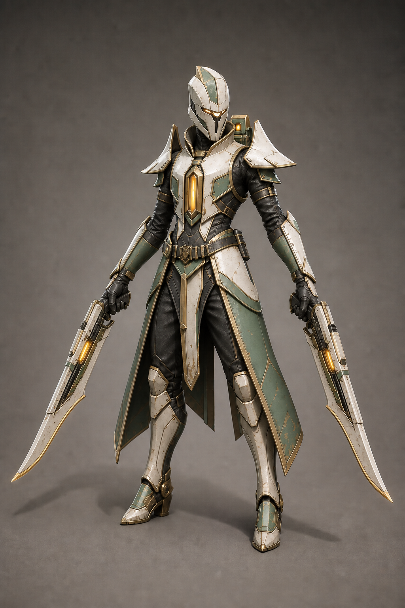
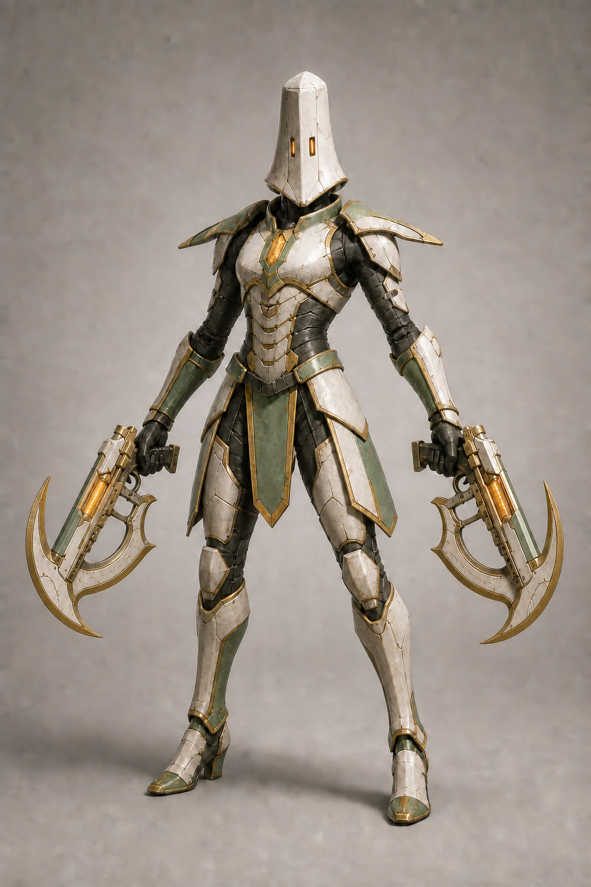
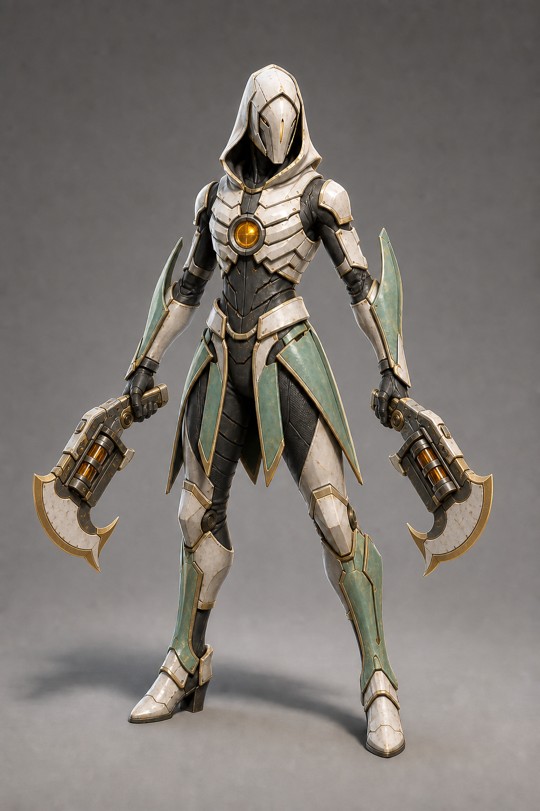
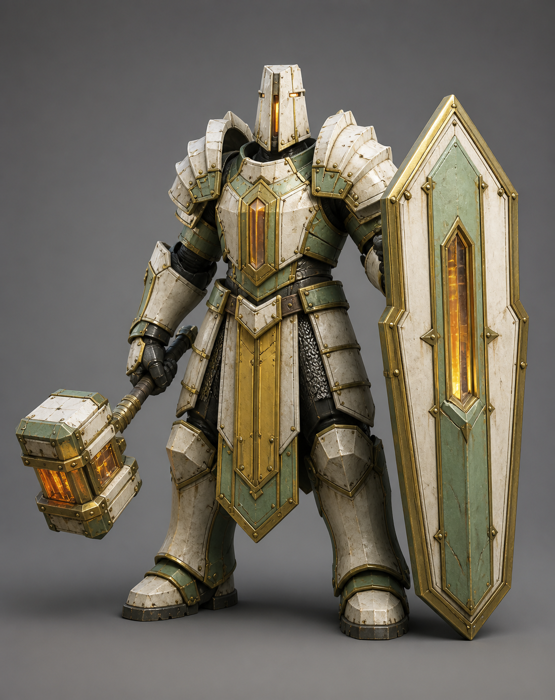
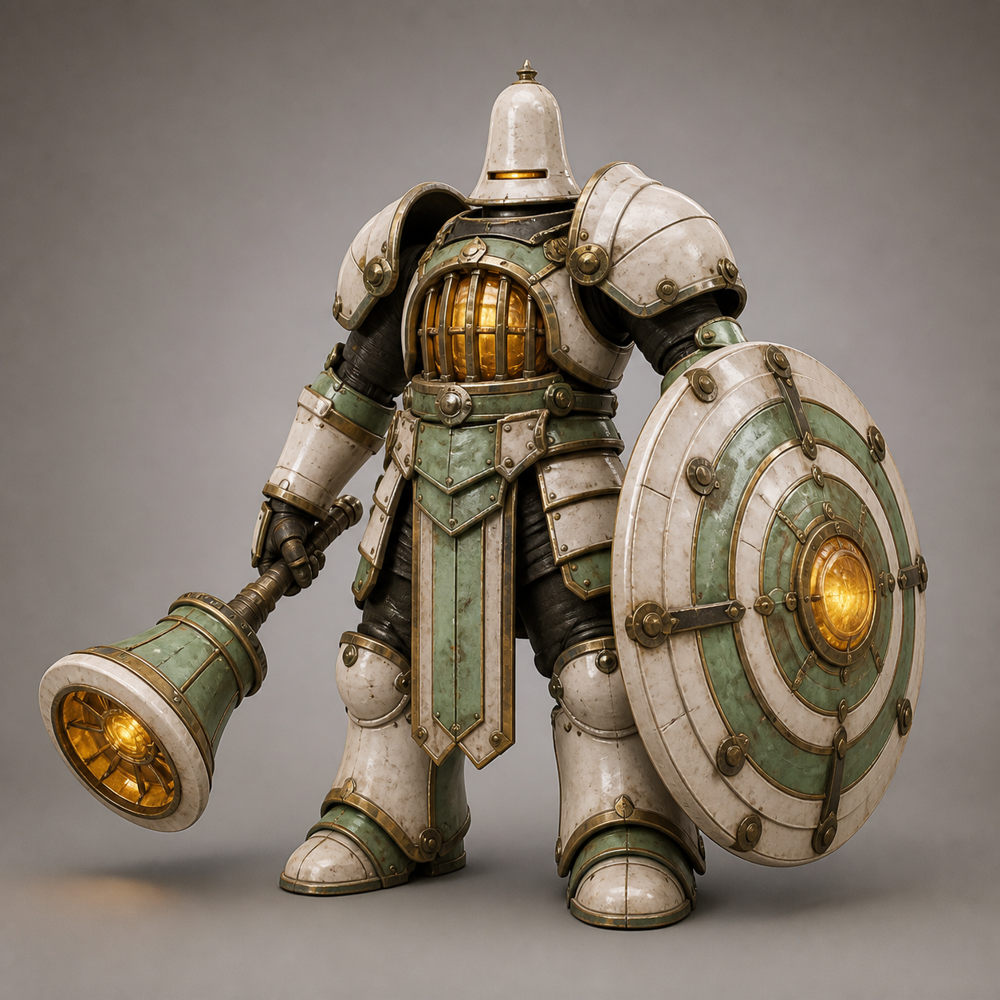
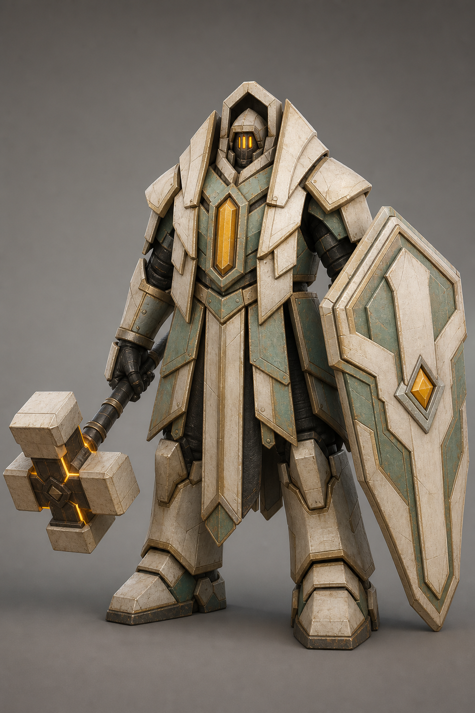

# Saintfall playable-character options

Six current full-resolution concept options for choosing two new playable Concord archetypes. The images were generated with the existing Vesper Reliquary model used only as a faction palette and material-language reference. The earlier firearm-only agile drafts remain beside the current hybrid-weapon versions for comparison.

## Shared art direction

- Warm ivory fired-ceramic plate as the dominant read.
- Restrained pale verdigris panels.
- Muted brass/gold trim.
- Blackened iron and dark woven pressure-suit joints.
- Small amber-orange emissive eyes and reliquary cores.
- Ceremonial science-fantasy construction, readable hard-surface planes, light desert wear.
- Faceless helmet, game-ready humanoid anatomy, clear weapon silhouettes.
- Every agile weapon must read immediately as both a functional medium-range firearm and a substantial melee weapon.

## Agile dual-wielder options

### A1 - Reliquary Corsair

Long pistol-sabres, swept shoulder fins, split coat panels, and a compact back reliquary. The most immediately readable gunblade-duelist silhouette.

Prompt delta: lean athletic runner; compact layered armor; narrow waist; long split rear coat panels clear of the legs; small swept-back shoulder fins; two matching long-barrel reliquary gunblades with full sabre-length ceramic cutting edges, visible muzzles, triggers, and amber firing chambers.

### A2 - Vesper Needle

Crescent repeater-sickles, a tall chapel-bell helmet, pointed layered shoulder pads, and a clean upper-back silhouette without vertical posts. The most acrobatic melee/ranged silhouette.

Prompt delta: wiry runner; compact ribbed cuirass; short thigh-length waist pennants; narrow reverse-swept layered shoulder pauldrons; no vertical lamps, rods, fins, or posts rising behind the shoulders; two matching crescent repeaters whose curved magazines and forward housings form large sharpened hooking and parrying blades.

### A3 - Canticle Skirmisher

Hooded shrine-mask silhouette, rotary axe-casters, layered rib plates, and green forearm/calf fins. The most mystical and visually aggressive hybrid option.

Prompt delta: lean acrobatic build; shallow armored cowl; no conventional large pauldrons; overlapping ivory rib plates; blade-shaped verdigris forearm and calf fins; circular amber sternum reliquary; two compact rotary firearms with visible triple-cylinder chambers and substantial forward-weighted crescent axe blades.

## Heavy hammer-and-shield options

### B1 - Bastion Penitent

Coffin tower shield, compact reliquary maul, buttress shoulders, and an armored tabard. The clearest classic tank silhouette.

Prompt delta: very large broad warrior; cathedral-buttress shoulders; huge gauntlets and planted boots; one rectangular amber-core maul; one shoulder-to-ankle coffin-shaped tower shield with a glowing chapel-window slit.

### B2 - Bellwarden

Concentric round shield, hollow bell hammer, domed armor, and a caged chest reliquary. The most original weapon language and strongest ceremonial personality.

Prompt delta: broad low-center-of-gravity build; rounded processional silhouette; domed overlapping shoulders; barrel-like chest cage; bell helmet; one hollow bell-headed war hammer; one large concentric round shield with an amber hub.

### B3 - Graven Processional

Hexagonal altar shield, four-faced masonry hammer, shrine-mask helmet, and descending mantle plates. The most ancient, monumental silhouette.

Prompt delta: monumental old-reliquary proportions; layered mantle plates instead of round shoulders; faceted shrine mask with three amber eye slits; one cross-faced masonry hammer; one broad hexagonal altar shield with a recessed amber diamond.

## Common generation prompt

Use case: `stylized-concept`. Asset type: Meshy-ready premium stylized-realistic 3D game character concept. Render one complete humanoid character only, full body and all weapons visible, neutral three-quarter front stance, centered on a simple warm-gray studio gradient with a subtle floor shadow. Use an orthographic-feeling 70 mm character-design lens, soft neutral studio key and rim lighting, readable PBR hard-surface materials, auto-riggable anatomy, and weapons held away from the body. For agile characters, require two matching weapons that each have an unmistakable muzzle, trigger, firing chamber, and substantial sharpened blade suitable for real melee attacks. Preserve the shared Saintfall palette above. No text, labels, logos, watermark, exposed face, horns, wings, halo, floating ornaments, extra limbs, extra weapons, modern military gear, generic space-marine styling, or busy background.

## Meshy implementation handoff

After an agile and heavy option are chosen, generate a neutral unarmed A-pose turnaround for each body and isolate every weapon as its own concept render. Build the body, each weapon, and the heavy shield as separate Meshy assets. This avoids weapon-to-hand/body fusion, gives cleaner humanoid auto-rigging, and lets gameplay code attach weapons to stable hand sockets.
